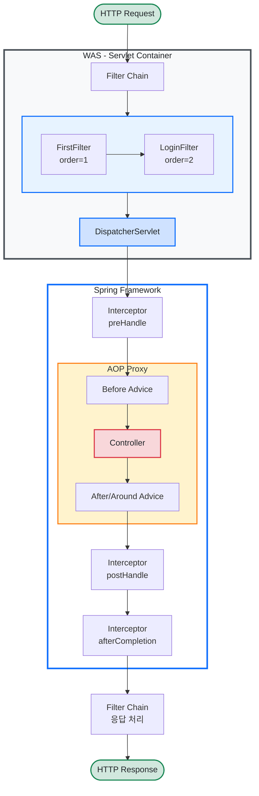

# Spring Filter, Interceptor, AOP 정리

## 요청 흐름 (Request Lifecycle)



---

## 1. Filter (필터)

### 개념

- **Servlet 스펙**에 정의된 기술로, Spring이 아닌 **WAS(서블릿 컨테이너)** 레벨에서 동작한다.
- `DispatcherServlet`에 요청이 도달하기 **전/후**에 실행된다.
- Spring의 Bean에 직접 접근하기 어렵지만, Spring Boot에서는 `@Component`나 `FilterRegistrationBean`으로 등록 가능하다.

### 주요 용도

| 용도        | 설명                                |
| ----------- | ----------------------------------- |
| 인코딩 처리 | 요청/응답의 Character Encoding 설정 |
| XSS 방어    | 요청 파라미터 필터링                |
| CORS 처리   | Cross-Origin 헤더 설정              |
| 로깅        | 모든 요청에 대한 접근 로그 기록     |
| 인증/인가   | Spring Security의 필터 체인         |

### 핵심 인터페이스

```java
public interface Filter {
    void init(FilterConfig filterConfig);       // 필터 초기화
    void doFilter(ServletRequest request,       // 요청 처리
                  ServletResponse response,
                  FilterChain chain);
    void destroy();                             // 필터 소멸
}
```

### 프로젝트 예시 - FirstFilter

```java
@Component
public class FirstFilter implements Filter {

    @Override
    public void doFilter(ServletRequest request, ServletResponse response, FilterChain chain)
            throws IOException, ServletException {
        System.out.println("--- First Filter ---");
        chain.doFilter(request, response);  // 다음 필터 또는 서블릿으로 전달
    }
}
```

> `chain.doFilter()`를 호출하지 않으면 요청이 더 이상 진행되지 않는다.

### 프로젝트 예시 - FilterConfig (등록)

```java
@Configuration
public class FilterConfig {

    // @Bean  ← 현재 비활성화 상태
    public FilterRegistrationBean<FirstFilter> firstFilterRegistration(FirstFilter firstFilter) {
        FilterRegistrationBean<FirstFilter> registration = new FilterRegistrationBean<>(firstFilter);
        registration.addUrlPatterns("/*");   // 모든 URL에 적용
        registration.setOrder(1);            // 실행 순서 (낮을수록 먼저)
        return registration;
    }
}
```

### 등록 방법 비교

| 방법                     | URL 패턴 지정 |      순서 제어      | 비고                               |
| ------------------------ | :-----------: | :-----------------: | ---------------------------------- |
| `@Component`             | X (전체 적용) |   `@Order`로 가능   | 간단하지만 세밀한 제어 어려움      |
| `FilterRegistrationBean` |       O       | `setOrder()`로 가능 | URL 패턴, 순서 등 세밀한 제어 가능 |

---

## 2. Interceptor (인터셉터)

### 개념

- **Spring MVC**에서 제공하는 기술로, `DispatcherServlet` 이후에 동작한다.
- Spring의 **Bean에 자유롭게 접근** 가능하다 (DI 가능).
- 컨트롤러 호출 전후와 뷰 렌더링 완료 후, 총 **3개 시점**에 개입할 수 있다.

### 주요 용도

| 용도           | 설명                               |
| -------------- | ---------------------------------- |
| 인증 체크      | 로그인 여부 확인 후 접근 제어      |
| 권한 체크      | 사용자 역할(Role)에 따른 접근 제어 |
| 로깅           | 컨트롤러 단위의 요청/응답 로그     |
| 공통 모델 주입 | 모든 뷰에 공통 데이터 전달         |

### 핵심 인터페이스

```java
public interface HandlerInterceptor {
    // 컨트롤러 호출 전 - false 반환 시 요청 중단
    boolean preHandle(HttpServletRequest request,
                      HttpServletResponse response,
                      Object handler);

    // 컨트롤러 호출 후, 뷰 렌더링 전
    void postHandle(HttpServletRequest request,
                    HttpServletResponse response,
                    Object handler,
                    ModelAndView modelAndView);

    // 뷰 렌더링 완료 후 (예외 발생해도 호출됨)
    void afterCompletion(HttpServletRequest request,
                         HttpServletResponse response,
                         Object handler,
                         Exception ex);
}
```

### 프로젝트 예시 - LoginInterceptor

```java
@Component
public class LoginInterceptor implements HandlerInterceptor {

    @Override
    public boolean preHandle(HttpServletRequest request, HttpServletResponse response,
                             Object handler) throws Exception {
        // /board/detail/숫자 패턴은 인증 없이 통과
        String uri = request.getRequestURI();
        if (uri.matches(".*/board/detail/\\d+$")) {
            return true;
        }

        // 세션에서 로그인 사용자 확인
        HttpSession session = request.getSession(false);
        SessionUser sessionUser = session != null
                ? (SessionUser) session.getAttribute("sessionUser") : null;

        if (sessionUser == null) {
            throw new RestServerErrorException("인증되지 않았습니다");
        }

        return true;  // true → 컨트롤러로 진행
    }
}
```

### 프로젝트 예시 - InterceptorConfig (등록)

```java
@Configuration
@RequiredArgsConstructor
public class InterceptorConfig implements WebMvcConfigurer {

    private final LoginInterceptor loginInterceptor;

    @Override
    public void addInterceptors(InterceptorRegistry registry) {
        registry.addInterceptor(loginInterceptor)
                .addPathPatterns("/**")                          // 모든 경로에 적용
                .excludePathPatterns(                             // 제외할 경로
                    "/", "/login-form", "/login",
                    "/join-form", "/join",
                    "/board/detail/**", "/api/**"
                );
    }
}
```

> `addPathPatterns`과 `excludePathPatterns`로 **적용/제외 경로를 세밀하게 제어**할 수 있다.

---

## 3. AOP (Aspect-Oriented Programming, 관점 지향 프로그래밍)

### 개념

- **횡단 관심사**(Cross-Cutting Concern)를 모듈화하는 프로그래밍 기법이다.
- Spring **프록시 기반**으로 동작하며, Bean의 메서드 실행 전후에 부가 기능을 삽입한다.
- URL 패턴이 아닌 **메서드 시그니처, 어노테이션** 등을 기준으로 적용 대상을 지정한다.

### 주요 용도

| 용도          | 설명                            |
| ------------- | ------------------------------- |
| 로깅          | 메서드 호출 정보 자동 기록      |
| 트랜잭션 관리 | `@Transactional`이 대표적인 AOP |
| 유효성 검증   | 공통 Validation 로직 분리       |
| 성능 측정     | 메서드 실행 시간 측정           |
| 예외 처리     | 공통 예외 처리 로직             |

### AOP 핵심 용어

| 용어          | 설명                                            |
| ------------- | ----------------------------------------------- |
| **Aspect**    | 횡단 관심사를 모듈화한 클래스 (`@Aspect`)       |
| **Advice**    | 실제 부가 기능 로직 (언제 실행할지)             |
| **Pointcut**  | Advice를 적용할 대상 지정 (어디에 적용할지)     |
| **JoinPoint** | Advice가 적용될 수 있는 지점 (메서드 실행 시점) |
| **Target**    | Advice가 적용되는 실제 객체                     |

### Advice 종류

| Advice            | 실행 시점                             |
| ----------------- | ------------------------------------- |
| `@Before`         | 메서드 실행 **전**                    |
| `@After`          | 메서드 실행 **후** (성공/실패 무관)   |
| `@AfterReturning` | 메서드 **정상 완료** 후               |
| `@AfterThrowing`  | 메서드에서 **예외 발생** 시           |
| `@Around`         | 메서드 실행 **전후** 모두 (가장 강력) |

### Pointcut 표현식

```java
// 패키지 내 모든 메서드
@Before("execution(* com.example.v4.board.service.*.*(..))")

// 특정 어노테이션이 붙은 메서드
@Before("@annotation(com.example.v4.global.annotation.ValidateOnError)")

// 특정 어노테이션이 붙은 클래스의 모든 메서드
@Before("@within(org.springframework.stereotype.Service)")
```

### 프로젝트 예시 - ValidationHandler

```java
@Aspect
@Component
public class ValidationHandler {

    // @ValidateOnError 어노테이션이 붙은 메서드 실행 전에 동작
    @Before("@annotation(com.example.v4.global.annotation.ValidateOnError)")
    public void validationCheck(JoinPoint jp) {
        MethodSignature signature = (MethodSignature) jp.getSignature();
        Method method = signature.getMethod();
        Object[] args = jp.getArgs();

        // 어노테이션 정보 가져오기
        ValidateOnError annotation = method.getAnnotation(ValidateOnError.class);

        // 메서드 파라미터에서 BindingResult와 @Valid DTO 찾기
        BindingResult br = null;
        Object dto = null;
        Parameter[] parameters = method.getParameters();
        for (int i = 0; i < parameters.length; i++) {
            if (args[i] instanceof BindingResult bindingResult) {
                br = bindingResult;
            }
            if (parameters[i].isAnnotationPresent(Valid.class)) {
                dto = args[i];
            }
        }

        // 유효성 검증 에러가 있으면 ValidationException 발생
        if (br != null && br.hasErrors()) {
            throw new ValidationException(br, dto, annotation.viewName(), ...);
        }
    }
}
```

> 컨트롤러마다 반복되는 `if (bindingResult.hasErrors())` 검증 로직을 **AOP로 한곳에 모아서 처리**한다.

---

## 4. Filter vs Interceptor vs AOP 비교

| 구분                      | Filter                   | Interceptor              | AOP                          |
| ------------------------- | ------------------------ | ------------------------ | ---------------------------- |
| **소속**                  | Servlet (Java EE)        | Spring MVC               | Spring Framework             |
| **동작 위치**             | DispatcherServlet **밖** | DispatcherServlet **안** | Spring Bean **프록시**       |
| **적용 기준**             | URL 패턴                 | URL 패턴                 | 메서드 시그니처 / 어노테이션 |
| **Spring Bean 접근**      | 제한적                   | 자유로움                 | 자유로움                     |
| **Request/Response 접근** | O                        | O                        | X (직접 접근 불가)           |
| **예외 처리**             | 직접 처리                | `@ControllerAdvice` 가능 | `@ControllerAdvice` 가능     |
| **대표 사용처**           | 인코딩, XSS, CORS        | 인증/인가, 로깅          | 트랜잭션, 유효성 검증, 로깅  |

### 선택 기준

```
Q: HttpServletRequest/Response를 직접 다뤄야 하는가?
├── Yes → Q: Spring Bean이 필요한가?
│         ├── Yes → Interceptor
│         └── No  → Filter
└── No  → Q: 비즈니스 로직에 횡단 관심사를 적용해야 하는가?
          └── Yes → AOP
```

---

## 5. 이 프로젝트에서의 활용 현황

| 구성 요소         | 파일                                       | 상태                  | 역할                           |
| ----------------- | ------------------------------------------ | --------------------- | ------------------------------ |
| FirstFilter       | `global/filter/FirstFilter.java`           | 비활성 (`@Bean` 주석) | 디버깅용 요청 로그             |
| LoginFilter       | `global/filter/LoginFilter.java`           | 비활성 (`@Bean` 주석) | 디버깅용 로그인 로그           |
| FilterConfig      | `global/config/FilterConfig.java`          | 비활성                | 필터 등록 설정                 |
| LoginInterceptor  | `global/interceptor/LoginInterceptor.java` | **활성**              | 로그인 인증 체크               |
| InterceptorConfig | `global/config/InterceptorConfig.java`     | **활성**              | 인터셉터 등록 설정             |
| ValidationHandler | `aop/ValidationHandler.java`               | **활성**              | `@ValidateOnError` 유효성 검증 |
